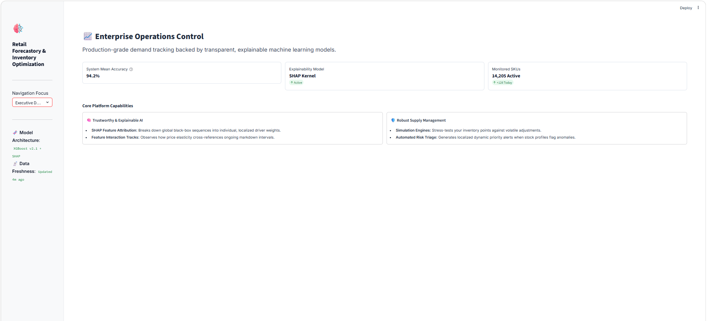
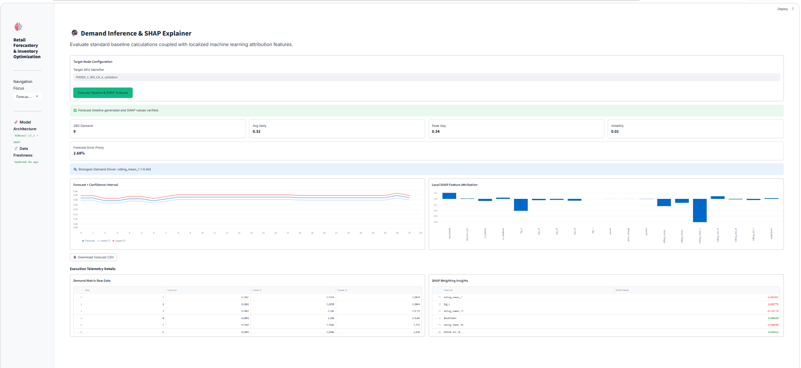
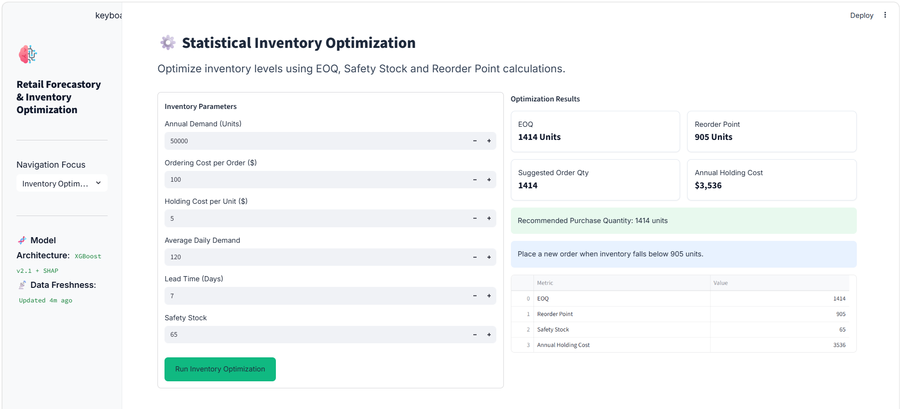
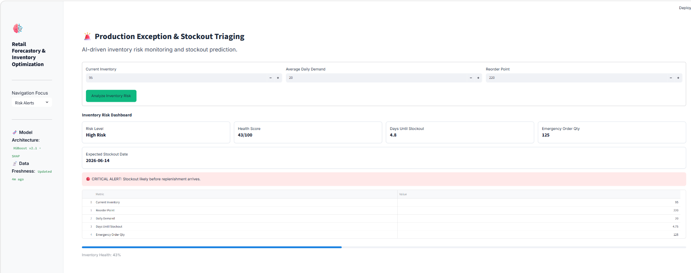
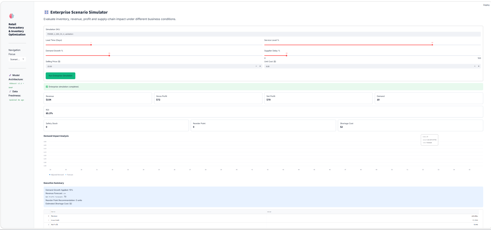

# Retail Sales Forecasting & Inventory Optimization

## Live Demo

https://retail-sales-forecastory-and-inventory-optimization-a3ym6efo3z.streamlit.app/

## Overview

Retail Sales Forecasting & Inventory Optimization is an end-to-end machine learning platform designed to predict future retail demand, optimize inventory decisions, assess stockout risks, and provide explainable AI insights for business users.

The system combines machine learning forecasting, inventory planning, risk monitoring, experiment tracking, explainable AI, API services, and Docker-based deployment into a production-oriented analytics platform.

---

## Key Highlights

* End-to-end retail demand forecasting pipeline
* XGBoost and LightGBM model training
* MLflow experiment tracking and model management
* SHAP explainability for model transparency
* Inventory optimization using safety stock and reorder point calculations
* Stockout risk assessment engine
* Scenario simulation for demand and supply chain planning
* FastAPI backend services
* Interactive Streamlit dashboard
* Docker containerization for deployment

---

## Features

### Demand Forecasting

* 28-day sales forecasting
* SKU-level demand prediction
* Automated feature engineering
* Forecast uncertainty estimation

### Explainable AI

* SHAP feature importance analysis
* Model interpretation dashboard
* Transparent forecasting decisions

### Inventory Optimization

* Safety Stock calculation
* Reorder Point estimation
* Inventory planning recommendations
* Service level optimization

### Risk Monitoring

* Stockout risk detection
* Inventory health assessment
* Replenishment recommendations

### Scenario Simulation

* Demand growth simulation
* Lead time sensitivity analysis
* Service level impact evaluation
* Inventory planning under uncertainty

### Experiment Tracking

* MLflow experiment tracking
* Parameter logging
* Metric logging
* Model artifact tracking
* Model version management

### Deployment

* FastAPI backend
* Streamlit frontend
* Docker containerization
* Reproducible deployment environment

---

## Dataset

The project uses retail demand forecasting data consisting of:

* Calendar information
* Historical sales transactions
* Product pricing information

Files used:

* calendar.csv
* sales_train_validation.csv
* sell_prices.csv

---

## Technology Stack

### Programming

* Python

### Machine Learning

* XGBoost
* LightGBM
* SHAP

### Data Processing

* Pandas
* NumPy

### Experiment Tracking

* MLflow

### Backend

* FastAPI

### Frontend

* Streamlit

### Deployment

* Docker

---

## Project Architecture

Retail Forecasting System

Data Ingestion

Data Validation

Feature Engineering

Model Training

MLflow Tracking

Forecast Generation

SHAP Explainability

Inventory Optimization

Risk Assessment

Scenario Simulation

FastAPI Services

Streamlit Dashboard

---

## API Endpoints

### Health Check

```http
GET /health
```

### Model Information

```http
GET /model-info
```

### Version

```http
GET /version
```

### Forecast

```http
GET /forecast/{item_id}
```

### Risk Assessment

```http
GET /risk/{item_id}
```

### Scenario Simulation

```http
POST /simulate
```

---

## Running Locally

Install dependencies:

```bash
pip install -r requirements.txt
```

Launch Streamlit dashboard:

```bash
streamlit run app.py
```

Launch FastAPI server:

```bash
uvicorn src.api:app --reload
```

---

## Docker

Build image:

```bash
docker build -t retailforecast2 -f docker/dockerfile .
```

Run container:

```bash
docker run -p 8501:8501 retailforecast2
```

---

## Application Screenshots

### Executive Dashboard



### Forecast & Explainability



### Inventory Optimization



### Risk Monitoring



### Scenario Simulator



---

## Future Improvements

* Deep learning forecasting models
* Automated retraining pipelines
* CI/CD integration
* Cloud deployment
* Real-time monitoring
* Multi-store forecasting
* Advanced supply chain optimization

---

## Author

Madhu Chandana

AI & Data Science Undergraduate

Focused on Machine Learning, Data Science, Forecasting Systems, MLOps, Explainable AI, and Production ML Engineering.
